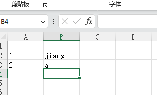

这是用node做的统计工具，还未完善，先上传暂存

背景：
统计某目录下所有文件名，并根据规则，进行处理，并将处理后的文件名写入到xls下


规则：
- 去掉后缀名
- 正则匹配
- 前缀处理
- 后缀处理
- 过滤
- 替换
- 重命名
- 分隔符
- xls导出文件配置

使用方式：

```
npm install
node app.js
```

测试：
node tets/test3.js


输出

照片

